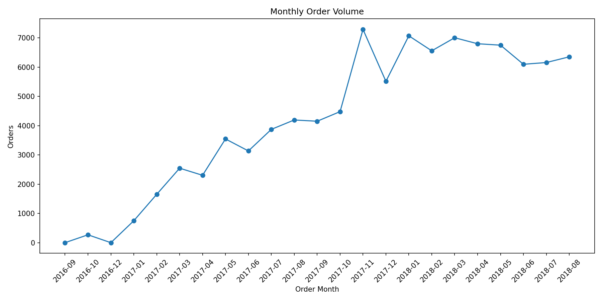
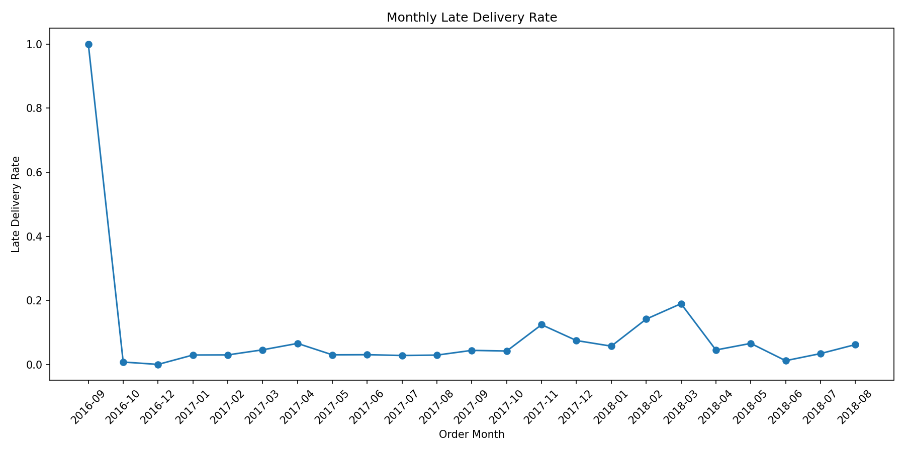
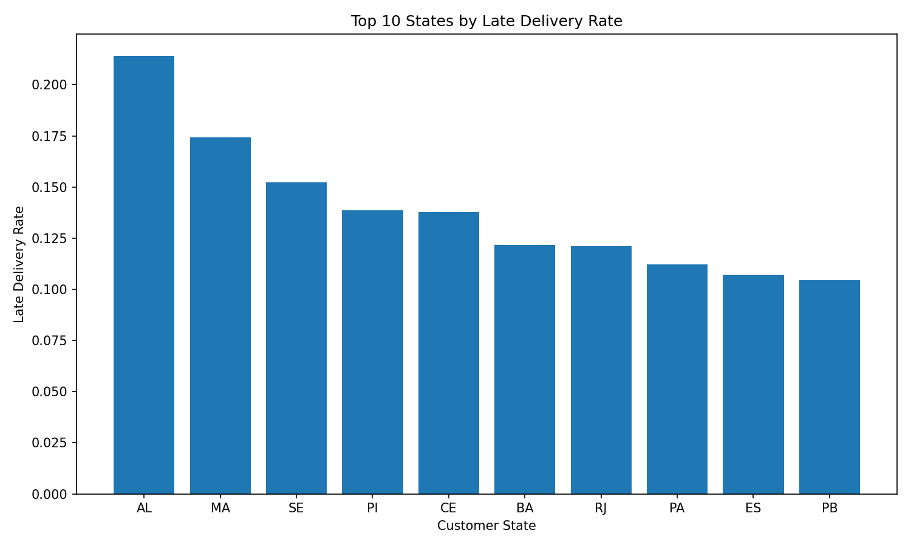
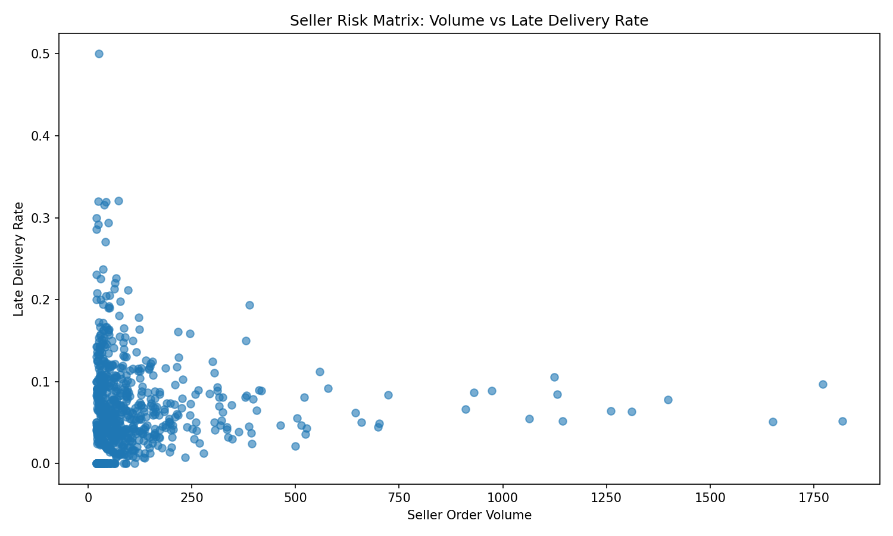

# Retail Supply Chain Control Tower

## Project Overview

This project builds an end-to-end supply chain analytics workflow using two public datasets:

1. **Olist Brazilian E-Commerce Dataset** — used for fulfillment, delivery, freight, seller, customer, and review performance analysis.
2. **M5 Walmart Forecasting Dataset** — used for SKU-level demand forecasting, ABC/XYZ inventory segmentation, safety stock, reorder point, and inventory policy recommendations.

The goal is to move beyond simple dashboard reporting and create a realistic analytics workflow that supports operational decision-making across fulfillment performance, demand planning, and inventory optimization.

---

## Business Objective

A retail/e-commerce company wants to:

* Identify late delivery drivers and fulfillment bottlenecks.
* Monitor seller and supplier reliability.
* Understand regional delivery performance differences.
* Forecast SKU-level demand.
* Classify SKUs by business value and demand volatility.
* Estimate safety stock and reorder points.
* Generate inventory recommendations to reduce stockout and overstock risk.

This project simulates how a supply chain analytics team could build a control-tower style reporting and decision-support workflow.

---

## Tools & Skills

* **Python:** pandas, numpy, matplotlib
* **Forecasting:** moving average baseline, weekday average demand baseline
* **Metrics:** MAE, RMSE, WAPE
* **Inventory Analytics:** ABC analysis, XYZ segmentation, safety stock, reorder point
* **Supply Chain KPIs:** delivery days, delay days, late delivery rate, freight-to-item ratio, seller risk score
* **GitHub Portfolio:** documented workflow, reusable scripts, generated tables, charts, and business findings
* **Planned Dashboard Layer:** Power BI / Qlik Sense dashboard for executive reporting

---

## Repository Structure

```text
retail-supply-chain-control-tower/
│
├── README.md
├── requirements.txt
├── check_environment.py
├── run_olist_eda.py
├── run_m5_forecasting_inventory.py
├── data_dictionary.md
│
├── config/
│   └── project_config.yaml
│
├── docs/
│   ├── business_questions.md
│   ├── dashboard_wireframe.md
│   ├── executive_summary_template.md
│   ├── local_setup_tomorrow.md
│   ├── project_roadmap.md
│   ├── olist_initial_findings.md
│   └── m5_demand_inventory_findings.md
│
├── notebooks/
│   ├── 01_olist_supply_chain_eda.ipynb
│   ├── 02_m5_demand_forecasting.ipynb
│   ├── 03_abc_xyz_inventory_segmentation.ipynb
│   ├── 04_inventory_policy_simulation.ipynb
│   └── 05_late_delivery_risk_model.ipynb
│
├── outputs/
│   ├── figures/
│   ├── tables/
│   ├── m5_figures/
│   └── m5_tables/
│
├── sql/
│   ├── 01_create_olist_tables.sql
│   ├── 02_clean_olist_data.sql
│   ├── 03_build_supply_chain_kpis.sql
│   ├── 04_seller_delivery_scorecard.sql
│   └── 05_late_delivery_features.sql
│
└── src/
    ├── data_cleaning.py
    ├── forecasting.py
    ├── inventory_policy.py
    ├── metrics.py
    └── visualization.py
```

---

## Data Sources

### 1. Olist Brazilian E-Commerce Dataset

Used for:

* Order fulfillment analysis
* Delivery lead time analysis
* Late delivery rate analysis
* Seller reliability scorecard
* Freight cost analysis
* Customer review outcome analysis

Expected raw files include:

```text
olist_orders_dataset.csv
olist_order_items_dataset.csv
olist_order_payments_dataset.csv
olist_order_reviews_dataset.csv
olist_customers_dataset.csv
olist_sellers_dataset.csv
olist_products_dataset.csv
product_category_name_translation.csv
olist_geolocation_dataset.csv
```

### 2. M5 Walmart Forecasting Dataset

Used for:

* SKU-level demand forecasting
* ABC/XYZ inventory segmentation
* Safety stock estimation
* Reorder point calculation
* Inventory recommendation generation

Expected raw files include:

```text
sales_train_validation.csv
calendar.csv
sell_prices.csv
```

Raw data files are not uploaded to this repository because of file size and data-source licensing considerations.

---

# Phase 1: Olist Fulfillment & Delivery Analytics

## Objective

The first phase analyzes the Olist Brazilian E-Commerce dataset to evaluate order fulfillment performance, delivery delays, seller reliability, freight cost, and customer review outcomes.

## Generated Outputs

* Order-level delivery KPI table
* Monthly supply chain KPI summary
* State-level delivery performance analysis
* Seller delivery risk scorecard
* Product category delivery KPI table
* Initial business findings document

## Key KPIs

The Olist analysis calculates:

* Total orders
* Delivered orders
* Late delivery rate
* Average delivery days
* Median delivery days
* Average delay days
* Total item value
* Total freight value
* Freight-to-item ratio
* Average customer review score

## Current Olist Results

| Metric                        |          Value |
| ----------------------------- | -------------: |
| Total Orders                  |         99,441 |
| Delivered Orders              |         96,476 |
| Late Delivery Rate            |          6.77% |
| Average Delivery Days         |          12.09 |
| Median Delivery Days          |          10.00 |
| Average Delay Days            |         -11.88 |
| Total Item Value              | $13,591,643.70 |
| Total Freight Value           |  $2,251,909.54 |
| Average Freight-to-Item Ratio |         30.84% |
| Average Review Score          |           4.09 |

## Key Analysis Areas

### 1. Delivery Performance

* Calculated actual delivery days, estimated delivery days, delay days, and late delivery flags.
* Measured monthly order volume and late delivery rate trends.
* Identified months with higher delivery risk.

### 2. Regional Fulfillment Bottlenecks

* Compared late delivery rates across customer states.
* Identified regions with higher fulfillment risk.
* Created state-level delivery KPI tables.

### 3. Seller Reliability

* Built a seller scorecard using order volume, late delivery rate, delivery time, freight value, and review score.
* Flagged high-volume sellers with elevated late delivery risk.
* Created a seller risk matrix based on order volume and late delivery rate.

### 4. Product Category Performance

* Compared product categories by order volume, freight cost, delivery delay, and review outcomes.
* Identified categories with higher operational risk.

---

## Olist Sample Visualizations

### Monthly Order Volume



### Monthly Late Delivery Rate



### Top 10 States by Late Delivery Rate



### Seller Risk Matrix



## Olist Findings

The initial Olist fulfillment and delivery findings are documented here:

[View Olist Initial Findings](docs/olist_initial_findings.md)

---

# Phase 2: M5 Demand Forecasting & Inventory Optimization

## Objective

The second phase extends the project from fulfillment analytics to demand planning and inventory optimization using the M5 Walmart forecasting dataset.

This module focuses on SKU-level demand analysis, interpretable forecasting baselines, ABC/XYZ inventory segmentation, safety stock estimation, reorder point calculation, and inventory recommendations.

## Scope

* Store analyzed: `CA_1`
* Category analyzed: `FOODS`
* Forecasting sample: Top 20 SKUs by 365-day unit demand
* Inventory segmentation sample: Top 100 SKUs by 365-day unit demand
* Holdout period: 28 days
* Assumed replenishment lead time: 7 days
* Service level assumption: approximately 95%, using z-score 1.65

---

## Generated Outputs

* SKU-level demand forecasting accuracy table
* Forecast vs actual demand visualization
* ABC/XYZ inventory segmentation summary
* Top SKU inventory recommendation table
* Safety stock and reorder point estimates
* M5 demand planning business findings document

## Key Analysis Areas

### 1. Demand Forecasting

The project compares simple, interpretable baseline models:

* 7-day moving average
* 28-day moving average
* Weekday average demand

Forecasting performance is evaluated using:

* MAE
* RMSE
* WAPE

Best model by average WAPE: **Weekday Average Demand**
Best model WAPE: **31.25%**

This result provides an interpretable demand-planning baseline. Future iterations can improve forecast accuracy by adding feature-based machine learning models such as Random Forest, XGBoost, or LightGBM.

### 2. ABC/XYZ Inventory Segmentation

The analysis classifies SKUs by both business value and demand variability.

**ABC classification** is based on cumulative estimated sales value:

| Class | Interpretation    |
| ----- | ----------------- |
| A     | High-value SKUs   |
| B     | Medium-value SKUs |
| C     | Lower-value SKUs  |

**XYZ classification** is based on demand volatility:

| Class | Interpretation         |
| ----- | ---------------------- |
| X     | Stable demand          |
| Y     | Moderate variability   |
| Z     | Highly volatile demand |

Combined examples:

| Segment | Business Meaning            |
| ------- | --------------------------- |
| AX      | High value, stable demand   |
| AZ      | High value, volatile demand |
| CX      | Low value, stable demand    |
| CZ      | Low value, volatile demand  |

Among the top 100 SKUs:

| Segment Metric              | Count |
| --------------------------- | ----: |
| A-class SKUs                |    49 |
| Z-class volatile SKUs       |    17 |
| AZ high-value volatile SKUs |     5 |

### 3. Safety Stock and Reorder Point

For each SKU, the script estimates:

* Average daily demand
* Demand standard deviation
* Safety stock
* Reorder point
* Recommended inventory action

Inventory policy assumptions:

| Assumption    |  Value |
| ------------- | -----: |
| Lead time     | 7 days |
| Service level |   ~95% |
| Z-score       |   1.65 |

Current output summary:

| Metric                            |        Value |
| --------------------------------- | -----------: |
| Average recommended safety stock  |  33.18 units |
| Average recommended reorder point | 112.24 units |

---

## M5 Sample Visualizations

### Daily Demand Trend


### Forecast vs Actual Demand


### ABC/XYZ Segment Distribution


### Top 20 Recommended Reorder Points


## M5 Findings

The M5 demand forecasting and inventory optimization findings are documented here:

[View M5 Demand & Inventory Findings](docs/m5_demand_inventory_findings.md)

---

# End-to-End Workflow

## 1. Data Preparation

* Load raw CSV files.
* Validate required columns and data availability.
* Convert date fields.
* Build order-level and SKU-level analytical tables.

## 2. Fulfillment Analytics

* Calculate delivery days and delay days.
* Flag late deliveries.
* Build monthly supply chain KPIs.
* Analyze regional fulfillment bottlenecks.
* Build seller and product category performance tables.

## 3. Demand Forecasting

* Select a focused SKU subset.
* Build daily demand history.
* Create holdout test period.
* Compare interpretable baseline forecasting models.
* Evaluate forecast accuracy using MAE, RMSE, and WAPE.

## 4. Inventory Segmentation

* Apply ABC classification based on estimated sales value.
* Apply XYZ classification based on coefficient of variation.
* Combine both classifications into ABC/XYZ segments.
* Identify high-priority inventory groups.

## 5. Inventory Policy Recommendation

* Estimate safety stock.
* Calculate reorder point.
* Generate SKU-level replenishment recommendations.
* Translate analytical results into business actions.

---

# How to Run This Project Locally

## 1. Clone the Repository

```bash
git clone https://github.com/Kyyy9492/Retail-Supply-Chain-Control-Tower.git
cd Retail-Supply-Chain-Control-Tower
```

## 2. Create and Activate a Virtual Environment

On Windows PowerShell:

```powershell
python -m venv .venv
.venv\Scripts\activate
```

If PowerShell blocks activation, run:

```powershell
Set-ExecutionPolicy -Scope CurrentUser -ExecutionPolicy RemoteSigned
.venv\Scripts\activate
```

## 3. Install Dependencies

```bash
pip install -r requirements.txt
```

## 4. Check Environment

```bash
python check_environment.py
```

## 5. Add Raw Data Locally

Create the following folders:

```text
data/raw/olist/
data/raw/m5/
```

Place the Olist CSV files under:

```text
data/raw/olist/
```

Place the M5 CSV files under:

```text
data/raw/m5/
```

Raw data is intentionally excluded from this repository.

## 6. Run Olist Fulfillment Analysis

```bash
python run_olist_eda.py
```

Generated outputs:

```text
outputs/tables/
outputs/figures/
docs/olist_initial_findings.md
```

## 7. Run M5 Demand & Inventory Analysis

```bash
python run_m5_forecasting_inventory.py
```

Generated outputs:

```text
outputs/m5_tables/
outputs/m5_figures/
docs/m5_demand_inventory_findings.md
```

---

# Business Recommendations

## Fulfillment & Delivery

* Monitor seller-level late delivery rate and order volume together.
* Prioritize high-volume sellers with above-average late delivery risk.
* Track state-level delivery bottlenecks for logistics follow-up.
* Use review score together with delivery KPIs to understand customer experience impact.

## Demand Planning

* Use simple baseline forecasting models as interpretable benchmarks.
* Improve future forecasting with feature-based machine learning models.
* Monitor high-volume SKUs separately from low-volume long-tail SKUs.

## Inventory Optimization

* Prioritize A-class SKUs for availability and service level.
* Monitor AZ SKUs closely because they combine high value with volatile demand.
* Use safety stock and reorder point estimates to support replenishment planning.
* Avoid overstocking low-value, volatile SKUs without clear demand signals.

---

# Future Improvements

Planned next steps:

* Add Power BI or Qlik Sense dashboard screenshots.
* Add SQL-based data mart implementation for Olist KPIs.
* Add late delivery classification model using seller, customer, product, freight, and time features.
* Add machine learning demand forecasting models such as Random Forest, XGBoost, or LightGBM.
* Add inventory policy simulation comparing current policy vs forecast-based replenishment.
* Add executive summary PDF for recruiter and interview use.

---

# Project Resume Summary

**Retail Supply Chain Control Tower | SQL, Python, Forecasting, Inventory Analytics**

* Built an end-to-end supply chain analytics workflow using Olist e-commerce and M5 Walmart sales data to analyze delivery performance, seller reliability, SKU demand patterns, and inventory replenishment strategies.
* Developed Python-based fulfillment KPIs, seller risk scorecards, and regional delivery analyses across 99K+ e-commerce orders to identify late-delivery bottlenecks.
* Implemented demand forecasting baselines using moving-average and weekday-demand models, evaluating performance with MAE, RMSE, and WAPE.
* Applied ABC/XYZ inventory segmentation to classify high-value and volatile SKUs, estimate safety stock, calculate reorder points, and generate replenishment recommendations.

---

# Status

Current project status:

* Olist fulfillment analytics completed.
* M5 demand forecasting and inventory segmentation completed.
* Output tables and figures generated.
* Business findings documents created.
* README updated for portfolio presentation.
* Dashboard layer planned as a future enhancement.
